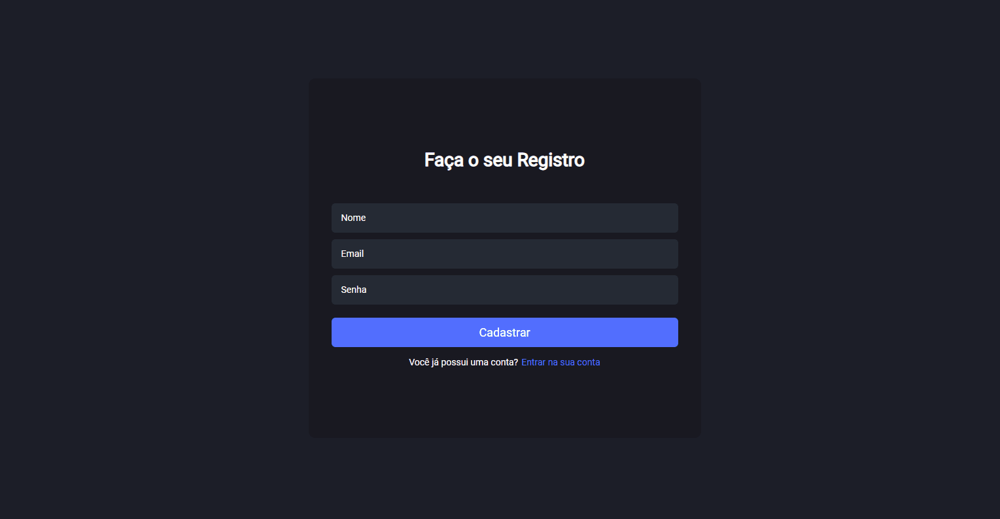

<h1 align="center">📞 CALL SYSTEM (Em progresso...)</h1>



> 🔎 O Call System ou Sistema de Chamados é uma ferramenta utilizada para centralizar demandas dos usuários. Ele serve para estabelecer uma rotina de gerenciamento dessas solicitações.

🗔 Confira a aplicação: https://www.linkedin.com/in/kayke-fujinaka/

## :page_facing_up: Explicação

O projeto foi realizado utilizando o framework [ReactJs](https://pt-br.reactjs.org/docs/getting-started.html) conectando com o [Firebase](https://firebase.google.com/docs) que ajudou na autenticação, cadastro, login e persistência dos dados.

🎲 **Como Funciona o Projeto**

Ele serve para estabelecer uma rotina de gerenciamento disponibilizado ao usuário, tendo algumas funcionalidades, como, por exemplo, criar um chamado, cadastrar uma empresa, editar informações do chamados/clientes, editar o perfil e etc.

O usuário consegue criar clientes ou empresas, a qual vão ser registradas dentro do site, podendo criar chamados depois.

Caso o usuário deseje cadastrar um chamado. Ele precisa colocar:

- Qual é o cliente que necessita desse serviço. Assim, vai aparecer uma lista com algumas empresas;
- O assunto que precisa ser tratado ou discutido;
- O status do chamado, sendo eles: Em Aberto, Progresso ou Atendido;
- Completo que serve para descrever melhor o problema, visando ter uma comunicação mais efetiva (Opcional).

⚠️ **Observações**

O visitante não terá acesso as rotas privadas. Caso não tenha se registrado ou realizado o login no site. Portanto, sempre que tentar acessar pela URL sem estar cadastrado/logado, ele será redirecionado para a página inicial.

Além disso, o usuário não poderá retornar a página inicial quando já estiver logado. Dessa maneira, ele necessitará deslogar na página Profile para retornar a tela de Login ou Registro.

## 📁 Páginas

O site tem no total 5 páginas, sendo elas:

- **Login:** A página para fazer o Login e ter acesso ao site.
- **Registro:** A página que tem a funcionalidade de cadastrar os usuários no site e assim ter acesso as outras páginas privadas.
- **Dashboard (Privada):** A página que tem a funcionalidade de registrar chamados.
- **Novo Chamado (Privada):** A página que tem a função de adicionar um novo chamado no Dashboard.
- **Customers (Privada):** A página que tem a funcionalidade de cadastrar uma empresa, colocando o nome da empresa, CPNJ e o endereço da empresa.
- **Profile (Privada):** A página que apresenta as informações (nome, email e avatar) do usuário cadastrado, a qual possui a funcionalidade de edita-las, exceto o e-mail.

## 🎯 Etapas

:heavy_check_mark: Estilos Globais do Projeto\
:heavy_check_mark: Adicionando Firebase\
:heavy_check_mark: Página/Rotas do Login e Registro\
:heavy_check_mark: Estruturação/Estilização do Login e Registro\
:heavy_check_mark: Página/Rota do Dashboard (Rota Privada)\
:heavy_check_mark: Context Criado\
:heavy_check_mark: Importando Ferramentas do Firebase\
:heavy_check_mark: Funcionalidade Login/Registro com o Firebase\
:heavy_check_mark: Adicionando Toastify\
:heavy_check_mark: Componente Header\
:heavy_check_mark: Componente Title\
:heavy_check_mark: Página/Rota do Perfil do usuário (Rota Privada)\
:heavy_check_mark: Estruturação/Estilização do Perfil\
:heavy_check_mark: Editar o Perfil\
:heavy_check_mark: Página/Rota do Customers (Rota Privada)\
:heavy_check_mark: Estruturação/Estilização do Customers\
:heavy_check_mark: Registrar uma Empresa no Customers\
:heavy_check_mark: Refatoração do Dashboard\
:heavy_check_mark: Estruturação/Estilização do Dashboard\
:heavy_check_mark: Página/Rota do New (Rota Privada)\
:heavy_check_mark: Funções na página para novos chamados\
:heavy_check_mark: Opção de buscar chamado no Dashboard\
:heavy_check_mark: Estruturação/Estilização do Modal\
:heavy_check_mark: Editar chamado\
:heavy_check_mark: Exemplo 5\
:x: Projeto Finalizado

--- ⚙️ Extra ---\
:heavy_check_mark: Adicionando Styled-Components\
:x: Exemplo 2

## 🚀 Tecnologias

- [ReactJs](https://pt-br.reactjs.org/docs/getting-started.html)
- [React Hooks](https://pt-br.reactjs.org/docs/hooks-intro.html)
- [React Router](https://v5.reactrouter.com/web/guides/quick-start)
- [React Icons](https://react-icons.github.io/react-icons/)
- [React Toastify](https://fkhadra.github.io/react-toastify/introduction)
- [AuthContext](https://blog.rocketseat.com.br/autenticacao-no-react-native-reactjs-com-context-api-hooks/)
- [Firebase](https://firebase.google.com/docs)
- [Styled Components](https://styled-components.com)
- [Date-fns](https://date-fns.org/docs/Getting-Started)

## :closed_book: Como usar?

Antes de iniciar, você precisa ter [Git](https://git-scm.com) e [Node](https://nodejs.org/en/) instalados.

```bash
# Clone this project
$ git clone https://github.com/Kayke-Fujinaka/Call-System

# Access
$ cd call-system

# Install dependencies
$ yarn or npm

# Run the project
$ yarn start or npm start

# The server will initialize in the <http://localhost:3000>
```

## 🤝 Colaboradores

Agradecemos às seguintes pessoas que contribuíram para este projeto:

<table>
  <tr>
    <td align="center">
      <a href="#">
        <br>
        <sub>
          <b>Kayke Fujinaka</b>
        </sub>
      </a>
    </td>
  </tr>
</table>

## 📝 Licença

Este projeto está sob licença. Consulte o arquivo [LICENSE](LICENSE.md) para obter mais detalhes.

&#xa0;

<a href="#top">Volte para o topo</a>
